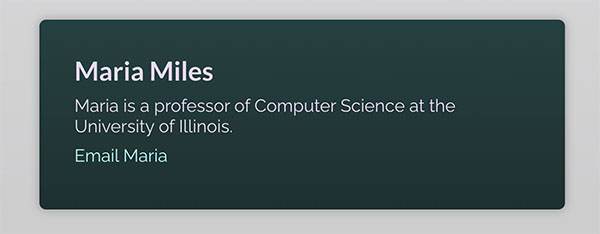

Компонентный состав 
Ваша задача — создать повторно используемый компонент `Card`, 
который принимает в качестве входных данных свойство `name` и, кроме того, может быть обернут 
вокруг любого кода JSX. 
Используйте уже существующий файл `Card.js`, чтобы создать в нем компонент `Card`. 
Вы можете добавить класс CSS карты к основному элементу упаковки в этом компоненте 
для придания некоторого стиля. Свойство `name` должно выводиться как заголовок внутри компонента `Card`,
а завернутый код JSX должен выводиться под этим заголовком.
Например, последний компонент `Card` можно использовать следующим образом:

```jsx
<Card name="Maria Miles">
  <p>
    Maria is a professor of Computer Science at the University of Illinois.
  </p>
  <p>
    <a href="mailto:blake@example.com">Email Maria</a>
  </p>
</Card>
```
Это должно дать следующий визуальный результат:


[Ссылка на упражнение](https://codesandbox.io/p/sandbox/exercise-6-component-composition-forked-yxwlfs?layout=%257B%2522sidebarPanel%2522%253A%2522EXPLORER%2522%252C%2522rootPanelGroup%2522%253A%257B%2522direction%2522%253A%2522horizontal%2522%252C%2522contentType%2522%253A%2522UNKNOWN%2522%252C%2522type%2522%253A%2522PANEL_GROUP%2522%252C%2522id%2522%253A%2522ROOT_LAYOUT%2522%252C%2522panels%2522%253A%255B%257B%2522type%2522%253A%2522PANEL_GROUP%2522%252C%2522contentType%2522%253A%2522UNKNOWN%2522%252C%2522direction%2522%253A%2522vertical%2522%252C%2522id%2522%253A%2522clqbif2xs0006356k4sq3s9pn%2522%252C%2522sizes%2522%253A%255B70%252C30%255D%252C%2522panels%2522%253A%255B%257B%2522type%2522%253A%2522PANEL_GROUP%2522%252C%2522contentType%2522%253A%2522EDITOR%2522%252C%2522direction%2522%253A%2522horizontal%2522%252C%2522id%2522%253A%2522EDITOR%2522%252C%2522panels%2522%253A%255B%257B%2522type%2522%253A%2522PANEL%2522%252C%2522contentType%2522%253A%2522EDITOR%2522%252C%2522id%2522%253A%2522clqbif2xs0002356kfiwb8egk%2522%257D%255D%257D%252C%257B%2522type%2522%253A%2522PANEL_GROUP%2522%252C%2522contentType%2522%253A%2522SHELLS%2522%252C%2522direction%2522%253A%2522horizontal%2522%252C%2522id%2522%253A%2522SHELLS%2522%252C%2522panels%2522%253A%255B%257B%2522type%2522%253A%2522PANEL%2522%252C%2522contentType%2522%253A%2522SHELLS%2522%252C%2522id%2522%253A%2522clqbif2xs0003356k1y1sren7%2522%257D%255D%252C%2522sizes%2522%253A%255B100%255D%257D%255D%257D%252C%257B%2522type%2522%253A%2522PANEL_GROUP%2522%252C%2522contentType%2522%253A%2522DEVTOOLS%2522%252C%2522direction%2522%253A%2522vertical%2522%252C%2522id%2522%253A%2522DEVTOOLS%2522%252C%2522panels%2522%253A%255B%257B%2522type%2522%253A%2522PANEL%2522%252C%2522contentType%2522%253A%2522DEVTOOLS%2522%252C%2522id%2522%253A%2522clqbif2xs0005356kmxmb63sh%2522%257D%255D%252C%2522sizes%2522%253A%255B100%255D%257D%255D%252C%2522sizes%2522%253A%255B50%252C50%255D%257D%252C%2522tabbedPanels%2522%253A%257B%2522clqbif2xs0002356kfiwb8egk%2522%253A%257B%2522tabs%2522%253A%255B%257B%2522id%2522%253A%2522clqbif2xs0001356kxeh8yk5s%2522%252C%2522mode%2522%253A%2522permanent%2522%252C%2522type%2522%253A%2522FILE%2522%252C%2522filepath%2522%253A%2522%252Fsrc%252Findex.js%2522%252C%2522state%2522%253A%2522IDLE%2522%257D%255D%252C%2522id%2522%253A%2522clqbif2xs0002356kfiwb8egk%2522%252C%2522activeTabId%2522%253A%2522clqbif2xs0001356kxeh8yk5s%2522%257D%252C%2522clqbif2xs0005356kmxmb63sh%2522%253A%257B%2522tabs%2522%253A%255B%257B%2522id%2522%253A%2522clqbif2xs0004356kpdrl3g5e%2522%252C%2522mode%2522%253A%2522permanent%2522%252C%2522type%2522%253A%2522UNASSIGNED_PORT%2522%252C%2522port%2522%253A0%252C%2522path%2522%253A%2522%252F%2522%257D%255D%252C%2522id%2522%253A%2522clqbif2xs0005356kmxmb63sh%2522%252C%2522activeTabId%2522%253A%2522clqbif2xs0004356kpdrl3g5e%2522%257D%252C%2522clqbif2xs0003356k1y1sren7%2522%253A%257B%2522tabs%2522%253A%255B%255D%252C%2522id%2522%253A%2522clqbif2xs0003356k1y1sren7%2522%257D%257D%252C%2522showDevtools%2522%253Atrue%252C%2522showShells%2522%253Atrue%252C%2522showSidebar%2522%253Atrue%252C%2522sidebarPanelSize%2522%253A15%257D)