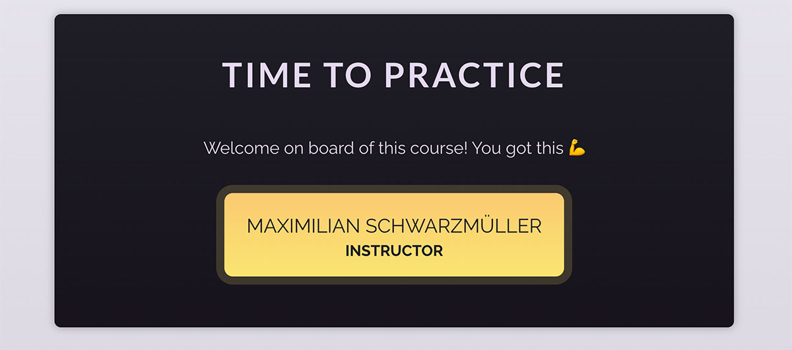

# Вывод динамического контента

Ваша задача — наполнить жизнью уже существующий компонент `User`! Вам следует вывести имя и фамилию пользователя 
(хранящиеся в уже существующем объекте `userData`) внутри элемента  компонента `User`.

Кроме того, вам следует вывести заголовок (также хранящийся в `userData`) в элементе внутри компонента `User`. 
Вам не разрешено копировать и вставлять значения в компонент. Готовое приложение может выглядеть так:

[Ссылка на код](https://codesandbox.io/p/sandbox/exercise-4-outputting-dynamic-content-n2n2c9?layout=%257B%2522sidebarPanel%2522%253A%2522EXPLORER%2522%252C%2522rootPanelGroup%2522%253A%257B%2522direction%2522%253A%2522horizontal%2522%252C%2522contentType%2522%253A%2522UNKNOWN%2522%252C%2522type%2522%253A%2522PANEL_GROUP%2522%252C%2522id%2522%253A%2522ROOT_LAYOUT%2522%252C%2522panels%2522%253A%255B%257B%2522type%2522%253A%2522PANEL_GROUP%2522%252C%2522contentType%2522%253A%2522UNKNOWN%2522%252C%2522direction%2522%253A%2522vertical%2522%252C%2522id%2522%253A%2522clq78janb0006356kuuzmbmmx%2522%252C%2522sizes%2522%253A%255B70%252C30%255D%252C%2522panels%2522%253A%255B%257B%2522type%2522%253A%2522PANEL_GROUP%2522%252C%2522contentType%2522%253A%2522EDITOR%2522%252C%2522direction%2522%253A%2522horizontal%2522%252C%2522id%2522%253A%2522EDITOR%2522%252C%2522panels%2522%253A%255B%257B%2522type%2522%253A%2522PANEL%2522%252C%2522contentType%2522%253A%2522EDITOR%2522%252C%2522id%2522%253A%2522clq78janb0002356kvbokfj1p%2522%257D%255D%257D%252C%257B%2522type%2522%253A%2522PANEL_GROUP%2522%252C%2522contentType%2522%253A%2522SHELLS%2522%252C%2522direction%2522%253A%2522horizontal%2522%252C%2522id%2522%253A%2522SHELLS%2522%252C%2522panels%2522%253A%255B%257B%2522type%2522%253A%2522PANEL%2522%252C%2522contentType%2522%253A%2522SHELLS%2522%252C%2522id%2522%253A%2522clq78janb0003356keykbl1x2%2522%257D%255D%252C%2522sizes%2522%253A%255B100%255D%257D%255D%257D%252C%257B%2522type%2522%253A%2522PANEL_GROUP%2522%252C%2522contentType%2522%253A%2522DEVTOOLS%2522%252C%2522direction%2522%253A%2522vertical%2522%252C%2522id%2522%253A%2522DEVTOOLS%2522%252C%2522panels%2522%253A%255B%257B%2522type%2522%253A%2522PANEL%2522%252C%2522contentType%2522%253A%2522DEVTOOLS%2522%252C%2522id%2522%253A%2522clq78janb0005356kgt7vnmok%2522%257D%255D%252C%2522sizes%2522%253A%255B100%255D%257D%255D%252C%2522sizes%2522%253A%255B50%252C50%255D%257D%252C%2522tabbedPanels%2522%253A%257B%2522clq78janb0002356kvbokfj1p%2522%253A%257B%2522id%2522%253A%2522clq78janb0002356kvbokfj1p%2522%252C%2522tabs%2522%253A%255B%255D%257D%252C%2522clq78janb0005356kgt7vnmok%2522%253A%257B%2522tabs%2522%253A%255B%257B%2522id%2522%253A%2522clq78janb0004356kvz5su817%2522%252C%2522mode%2522%253A%2522permanent%2522%252C%2522type%2522%253A%2522UNASSIGNED_PORT%2522%252C%2522port%2522%253A0%252C%2522path%2522%253A%2522%252F%2522%257D%255D%252C%2522id%2522%253A%2522clq78janb0005356kgt7vnmok%2522%252C%2522activeTabId%2522%253A%2522clq78janb0004356kvz5su817%2522%257D%252C%2522clq78janb0003356keykbl1x2%2522%253A%257B%2522tabs%2522%253A%255B%255D%252C%2522id%2522%253A%2522clq78janb0003356keykbl1x2%2522%257D%257D%252C%2522showDevtools%2522%253Atrue%252C%2522showShells%2522%253Atrue%252C%2522showSidebar%2522%253Atrue%252C%2522sidebarPanelSize%2522%253A15%257D)