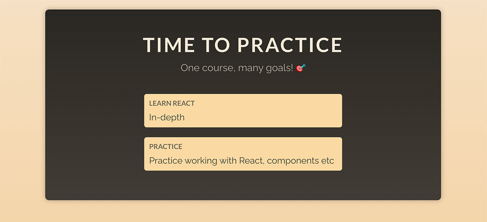

# Working with Props

Ваша задача — сделать компонент `CourseGoal` многоразовым/настраиваемым. Он должен принимать входные данные 
«title» и «description» и выводить полученные данные между тегами (`h2`) и (`p`).
Затем компонент `App` должен отобразить как минимум два экземпляра компонента `CourseGoal`. 
Один из этих компонентов `CourseGoal` должен получить название «Learn React» и описание 
«In-depth». Остальные названия и описания полностью зависят от вас. Готовое приложение может выглядеть так:

[Ссылка на код](https://codesandbox.io/p/sandbox/exercise-5-working-with-props-n9l87m?layout=%257B%2522sidebarPanel%2522%253A%2522EXPLORER%2522%252C%2522rootPanelGroup%2522%253A%257B%2522direction%2522%253A%2522horizontal%2522%252C%2522contentType%2522%253A%2522UNKNOWN%2522%252C%2522type%2522%253A%2522PANEL_GROUP%2522%252C%2522id%2522%253A%2522ROOT_LAYOUT%2522%252C%2522panels%2522%253A%255B%257B%2522type%2522%253A%2522PANEL_GROUP%2522%252C%2522contentType%2522%253A%2522UNKNOWN%2522%252C%2522direction%2522%253A%2522vertical%2522%252C%2522id%2522%253A%2522clq7mvryq0006356krioz8355%2522%252C%2522sizes%2522%253A%255B100%252C0%255D%252C%2522panels%2522%253A%255B%257B%2522type%2522%253A%2522PANEL_GROUP%2522%252C%2522contentType%2522%253A%2522EDITOR%2522%252C%2522direction%2522%253A%2522horizontal%2522%252C%2522id%2522%253A%2522EDITOR%2522%252C%2522panels%2522%253A%255B%257B%2522type%2522%253A%2522PANEL%2522%252C%2522contentType%2522%253A%2522EDITOR%2522%252C%2522id%2522%253A%2522clq7mvryq0002356kzi9fmf2x%2522%257D%255D%257D%252C%257B%2522type%2522%253A%2522PANEL_GROUP%2522%252C%2522contentType%2522%253A%2522SHELLS%2522%252C%2522direction%2522%253A%2522horizontal%2522%252C%2522id%2522%253A%2522SHELLS%2522%252C%2522panels%2522%253A%255B%257B%2522type%2522%253A%2522PANEL%2522%252C%2522contentType%2522%253A%2522SHELLS%2522%252C%2522id%2522%253A%2522clq7mvryq0003356k4cfqsdcf%2522%257D%255D%252C%2522sizes%2522%253A%255B100%255D%257D%255D%257D%252C%257B%2522type%2522%253A%2522PANEL_GROUP%2522%252C%2522contentType%2522%253A%2522DEVTOOLS%2522%252C%2522direction%2522%253A%2522vertical%2522%252C%2522id%2522%253A%2522DEVTOOLS%2522%252C%2522panels%2522%253A%255B%257B%2522type%2522%253A%2522PANEL%2522%252C%2522contentType%2522%253A%2522DEVTOOLS%2522%252C%2522id%2522%253A%2522clq7mvryq0005356k8e02lt6n%2522%257D%255D%252C%2522sizes%2522%253A%255B100%255D%257D%255D%252C%2522sizes%2522%253A%255B50%252C50%255D%257D%252C%2522tabbedPanels%2522%253A%257B%2522clq7mvryq0002356kzi9fmf2x%2522%253A%257B%2522id%2522%253A%2522clq7mvryq0002356kzi9fmf2x%2522%252C%2522tabs%2522%253A%255B%255D%257D%252C%2522clq7mvryq0005356k8e02lt6n%2522%253A%257B%2522tabs%2522%253A%255B%257B%2522id%2522%253A%2522clq7mvryq0004356kr9537fbu%2522%252C%2522mode%2522%253A%2522permanent%2522%252C%2522type%2522%253A%2522UNASSIGNED_PORT%2522%252C%2522port%2522%253A0%252C%2522path%2522%253A%2522%252F%2522%257D%255D%252C%2522id%2522%253A%2522clq7mvryq0005356k8e02lt6n%2522%252C%2522activeTabId%2522%253A%2522clq7mvryq0004356kr9537fbu%2522%257D%252C%2522clq7mvryq0003356k4cfqsdcf%2522%253A%257B%2522tabs%2522%253A%255B%255D%252C%2522id%2522%253A%2522clq7mvryq0003356k4cfqsdcf%2522%257D%257D%252C%2522showDevtools%2522%253Atrue%252C%2522showShells%2522%253Afalse%252C%2522showSidebar%2522%253Atrue%252C%2522sidebarPanelSize%2522%253A15%257D)
